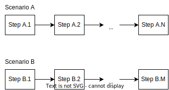
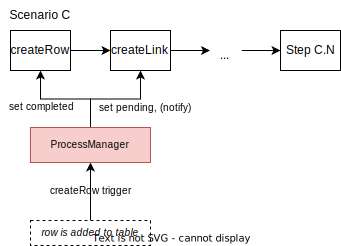
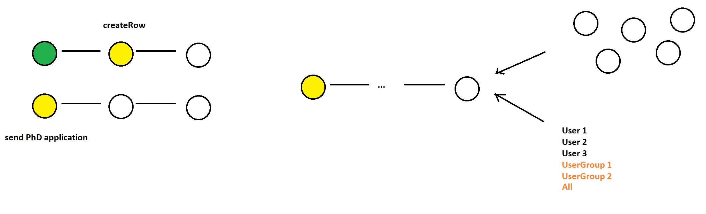

# Scenarios
With the app, different scenarios should be addressed. Examples would be:
- PhD admission
- HiWi contracts
- Teaching evaluation
- ...

What all of the scenarios have in common is that they follow a predefined process. The intermediate steps of the process must be completed in order. For each scenario, the steps and their number differ.

To handle scenarios with the app, we propose the following data model.

# Model

## Workflow
Each scenario is modeled by a *workflow*. A workflow has the following properties and contains an ordered list of steps that must be completed (definition via interface `Workflow`):
| Property | Description |
| ----------- | ----------- |
| _id | internal id of the workflow |
| index | used for table sorting |
| name | name of the workflow |
| description | description of the workflow |
| steps | unordered list of steps of the workflow |
| connections | connections of the workflow. used to bring steps in order |
| startstep | first step of the workflow |
| history | list of completed steps (stepId and timestamp) |
| owner | owner of the workflow (userId) |
| state | current state of the workflow |
| majorsteps | list of majorsteps of the workflow (stepIds) |

Concrete workflows can be constructed in a Admin UI. In this UI, the Admin is able to concatenate steps into a workflow. Each time a step is added, a responsible must be provided. As soon as the prior steps have been completed, the responsible is notified to trigger the next action. After the workflow is created, the workflow can be activated and the first step is pending for user interaction.

As soon as the process state of the first step changes, the workflow is duplicated and will therefore be available for the next user to start the same workflow again.

## Step
Each step is modeled by a *step*. A step has the following properties (definition via interface `Step`):
| Property | Description |
| ----------- | ----------- |
| _id | internal id of the step |
| name | name of the workflow |
| description | description of the workflow |
| type | type of the step (manual or automatic) |
| trigger | trigger to complete the step (string) |
| responsible | \[optional\] who must complete the step (userId) (manual step)|
| delay | \[optional\] how much should the step execution be delayed (automatic step) |
| state | current state of the step |
| data | data required for step completion |

New steps are instantiated when a new workflow is created. A step is created via a template step. Step templates are available for common actions (e.g. adding a row to a table). However, we provide the functionality to create new templates programmatically.

Although multiple steps can have the same actions (e.g. adding a row to a table), each step is assigned to **exactly one** workflow.

## Step/Workflow Progression
Steps (and thus workflows) are progressed using the *trigger* of steps. Once a step is triggered, the step is set to `Completed`, the *responsible* of the next step is notified (if applicable) and the next step is set active.

Triggers are fired during the execution of common actions. Concretely, e.g. once a new row is added to a table, a trigger is fired with the keyword `createRow`. This trigger is picked up and processed by the `ProcessManager`.

## ProcessManager
The ProcessManager handles all functionality of workflows and steps. Its task is to manage the state of workflows and steps and to listen for triggers to progress and update workflows and steps. The ProcessManager exposes several functions that can be used by other components to e.g. create new workflows or register actions.

<!-- ## Visualization

## Draft of Admin UI
 -->

# Types

## Workflow

| Property | Description |
| ----------- | ----------- |
| _id | internal id of the workflow |
| index | used for table sorting |
| name | name of the workflow |
| description | description of the workflow |
| steps | unordered list of steps of the workflow |
| connections | connections of the workflow. used to bring steps in order. |
| startstep | first step of the workflow |
| history | list of completed steps (stepId and timestamp) |
| owner | owner of the workflow (userId) |
| state | current state of the workflow |
| majorsteps | list of majorsteps of the workflow (stepIds) |

## Step

| Property | Description |
| ----------- | ----------- |
| _id | internal id of the step |
| name | name of the workflow |
| description | description of the workflow |
| type | type of the step (manual or automatic) |
| trigger | trigger to complete the step (string) |
| responsible | \[optional\] who must complete the step (userId) (manual step)|
| delay | \[optional\] how much should the step execution be delayed (automatic step) |
| state | current state of the step |
| data | data required for step completion |

## Job

| Property | Description |
| ----------- | ----------- |
| _id | internal id of the job |
| name | name of the job |
| deadline | when the job will be executed |
| workflowId | the id of the workflow to which the job is assigned |
| autoaction | is the job automatic? |
| stepData | additional data required for the job execution |
| state | the current state of the job |

## PMResponse

| Property | Description |
| ----------- | ----------- |
| status | integer (similar to http status codes) indicating the status of the request |
| message | \[optional\] explanation for the status, mostly used in case of failure |
| workflow | \[optional\] the affected workflow |
| items | \[optional\] notification items |

## AutomaticStepTemplate

Used for creating new steps via the UI. All missing properties will be added via backend logic.

| Property | Description |
| ----------- | ----------- |
| _id | internal id of the step |
| index | used for table sorting |
| trigger | trigger to complete the step (string) |
| data | data required for step completion |
| helptext | description of the step |

## DataFieldProperties

| Property | Description |
| ----------- | ----------- |
| required | \[optional\] whether the property is required |
| multiline | \[optional\] whether the property's input field should be multi-line |
| type | \[optional\] what the property's input field type should be |

# API Documentation
## Functions

<dl>
<dt><a href="#abortWorkflow">abortWorkflow(workflowId, owner)</a> ⇒ <code>CoreRequest</code></dt>
<dd>
Aborts a workflow with the given id and owner.

Response: { success: boolean, reason: string } Contains a confirmation or reason why the workflow could not be aborted.

</dd>
<dt><a href="#blockWorkflow">blockWorkflow(workflowId, owner)</a> ⇒ <code>CoreRequest</code></dt>
<dd>
Blocks a workflow with the given id and owner.

Response: { success: boolean, reason: string } Contains a confirmation or reason why the workflow could not be blocked.

</dd>
<dt><a href="#deleteWorkflow">deleteWorkflow(workflowId, owner)</a> ⇒ <code>CoreRequest</code></dt>
<dd>
Deletes a workflow with the given id and owner.

Response: { status: number, message?: string } HTTP status code and depending if there was an error,
a message why the workflow could not be deleted.

</dd>
<dt><a href="#getActiveWorkflows">getActiveWorkflows()</a> ⇒ <code>CoreRequest</code></dt>
<dd>
Query all active workflows

</dd>
<dt><a href="#getWorkflow">getWorkflow(workflowId)</a> ⇒ <code>CoreRequest</code></dt>
<dd>
Get workflow with the given id.

Response: { PMResponse } The workflow matching the given id.

</dd>
<dt><a href="#copyWorkflow">copyWorkflow(workflowId)</a> ⇒ <code>CoreRequest</code></dt>
<dd>
Copy workflow with the given id.

Response: { Workflow } The workflow matching the given id.

</dd>
<dt><a href="#getWorkflowProgress">getWorkflowProgress(workflowId)</a> ⇒ <code>CoreRequest</code></dt>
<dd>
Get workflow progress of the given id.

Response: { name: string, state: ProcessState }[]

</dd>
<dt><a href="#getWorkflowTemplates">getWorkflowTemplates()</a> ⇒ <code>CoreRequest</code></dt>
<dd>
Query all workflow templates

</dd>
<dt><a href="#getAutomaticStepTemplates">getAutomaticStepTemplates()</a> ⇒ <code>CoreRequest</code></dt>
<dd>
Query all automatic steps

</dd>
<dt><a href="#registerAction">registerAction(trigger, [user], [workflowIds])</a> ⇒ <code>CoreRequest</code></dt>
<dd>
Registers a manual action and advances all relevant related workflows.

Response: { string[] } workflow ids, that have been changed

</dd>
<dt><a href="#unblockWorkflow">unblockWorkflow(workflowId, owner)</a> ⇒ <code>CoreRequest</code></dt>
<dd>
Unblocks a blocked workflow with the given id and owner.

Response: { success: boolean, reason: string } Contains a confirmation or reason why the workflow could not be blocked.

</dd>
<dt><a href="#createUpdateWorkflow">createUpdateWorkflow()</a> ⇒ <code>CoreRequest</code></dt>
<dd>
Create a new workflow

</dd>
<dt><a href="#getItemsForUser">getItemsForUser()</a> ⇒ <code>CoreRequest</code></dt>
<dd>
Fetch all items for the given user

</dd>
<dt><a href="#activateWorkflowTemplate">activateWorkflowTemplate(workflowId)</a> ⇒ <code>CoreRequest</code></dt>
<dd>
Activate workflow template with the given id.

Response: { PMResponse } If the workflowTemplate could be activated.

</dd>
<dt><a href="#deactivateWorkflowTemplate">deactivateWorkflowTemplate(workflowId)</a> ⇒ <code>CoreRequest</code></dt>
<dd>
Deactivate workflow template with the given id.

Response: { PMResponse } If the workflowTemplate could be deactivated.

</dd>
</dl>

## abortWorkflow(workflowId, owner) ⇒ <code>CoreRequest</code>
Aborts a workflow with the given id and owner.

Response: { success: boolean, reason: string } Contains a confirmation or reason why the workflow could not be aborted.

**Kind**: global function  
**Returns**: <code>CoreRequest</code> - Contains a confirmation or reason why the workflow could not be aborted.  

| Param | Type | Description |
| --- | --- | --- |
| workflowId | <code>string</code> | The id of the workflow that should be aborted. |
| owner | <code>User</code> | The owner that the workflow belongs to. |

## blockWorkflow(workflowId, owner) ⇒ <code>CoreRequest</code>
Blocks a workflow with the given id and owner.

Response: { success: boolean, reason: string } Contains a confirmation or reason why the workflow could not be blocked.

**Kind**: global function  
**Returns**: <code>CoreRequest</code> - Contains a confirmation or reason why the workflow could not be blocked.  

| Param | Type | Description |
| --- | --- | --- |
| workflowId | <code>string</code> | The id of the workflow that should be blocked. |
| owner | <code>User</code> | The owner that the workflow belongs to. |

## deleteWorkflow(workflowId, owner) ⇒ <code>CoreRequest</code>
Deletes a workflow with the given id and owner.

Response: { status: number, message?: string } HTTP status code and depending if there was an error,
a message why the workflow could not be deleted.

**Kind**: global function  
**Returns**: <code>CoreRequest</code> - Contains a confirmation or reason why the workflow could not be deleted.  

| Param | Type | Description |
| --- | --- | --- |
| workflowId | <code>string</code> | The id of the workflow that should be deleted. |
| owner | <code>User</code> | The owner that the workflow belongs to. |

## getActiveWorkflows() ⇒ <code>CoreRequest</code>
Query all active workflows

**Kind**: global function  
**Returns**: <code>CoreRequest</code> - Contains an array of all active workflows  

## getWorkflow(workflowId) ⇒ <code>CoreRequest</code>
Get workflow with the given id.

Response: { PMResponse } The workflow matching the given id.

**Kind**: global function  
**Returns**: <code>CoreRequest</code> - The workflow matching the given id.  

| Param | Type | Description |
| --- | --- | --- |
| workflowId | <code>string</code> | The id of the workflow that should be returned. |

## copyWorkflow(workflowId) ⇒ <code>CoreRequest</code>
Copy workflow with the given id.

Response: { Workflow } The workflow matching the given id.

**Kind**: global function  
**Returns**: <code>CoreRequest</code> - The workflow matching the given id.  

| Param | Type | Description |
| --- | --- | --- |
| workflowId | <code>string</code> | The id of the workflow to copy. |

## getWorkflowProgress(workflowId) ⇒ <code>CoreRequest</code>
Get workflow progress of the given id.

Response: { name: string, state: ProcessState }[]

**Kind**: global function  
**Returns**: <code>CoreRequest</code> - Array of workflow step names and state.  

| Param | Type | Description |
| --- | --- | --- |
| workflowId | <code>string</code> | The id of the workflow the steps should be returned from. |

## getWorkflowTemplates() ⇒ <code>CoreRequest</code>
Query all workflow templates

**Kind**: global function  
**Returns**: <code>CoreRequest</code> - Contains an array of all workflow templates  

## getAutomaticStepTemplates() ⇒ <code>CoreRequest</code>
Query all automatic steps

**Kind**: global function  
**Returns**: <code>CoreRequest</code> - Contains an array of all automatic steps  

## registerAction(trigger, [user], [workflowIds]) ⇒ <code>CoreRequest</code>
Registers a manual action and advances all relevant related workflows.

Response: { string[] } workflow ids, that have been changed

**Kind**: global function  
**Returns**: <code>CoreRequest</code> - void  

| Param | Type | Description |
| --- | --- | --- |
| trigger | <code>string</code> | The name of the manual action, also known as trigger property of a step. |
| [user] | <code>User</code> | The user that triggered the manual action. |
| [workflowIds] | <code>Array.&lt;string&gt;</code> | The workflowIds to advance |

## unblockWorkflow(workflowId, owner) ⇒ <code>CoreRequest</code>
Unblocks a blocked workflow with the given id and owner.

Response: { success: boolean, reason: string } Contains a confirmation or reason why the workflow could not be blocked.

**Kind**: global function  
**Returns**: <code>CoreRequest</code> - Contains a confirmation or reason why the workflow could not be blocked.  

| Param | Type | Description |
| --- | --- | --- |
| workflowId | <code>string</code> | The id of the workflow that should be blocked. |
| owner | <code>User</code> | The owner that the workflow belongs to. |

## createUpdateWorkflow() ⇒ <code>CoreRequest</code>
Create a new workflow

**Kind**: global function  
**Returns**: <code>CoreRequest</code> - Contains the newly created workflow  

## getItemsForUser() ⇒ <code>CoreRequest</code>
Fetch all items for the given user

**Kind**: global function  
**Returns**: <code>CoreRequest</code> - Contains an array of all open items  

## activateWorkflowTemplate(workflowId) ⇒ <code>CoreRequest</code>
Activate workflow template with the given id.

Response: { PMResponse } If the workflowTemplate could be activated.

**Kind**: global function  
**Returns**: <code>CoreRequest</code> - If the workflowTemplate could be activated.  

| Param | Type | Description |
| --- | --- | --- |
| workflowId | <code>string</code> | The id of the workflow that should be activated. |

## deactivateWorkflowTemplate(workflowId) ⇒ <code>CoreRequest</code>
Deactivate workflow template with the given id.

Response: { PMResponse } If the workflowTemplate could be deactivated.

**Kind**: global function  
**Returns**: <code>CoreRequest</code> - If the workflowTemplate could be deactivated.  

| Param | Type | Description |
| --- | --- | --- |
| workflowId | <code>string</code> | The id of the workflow that should be deactivated. |
